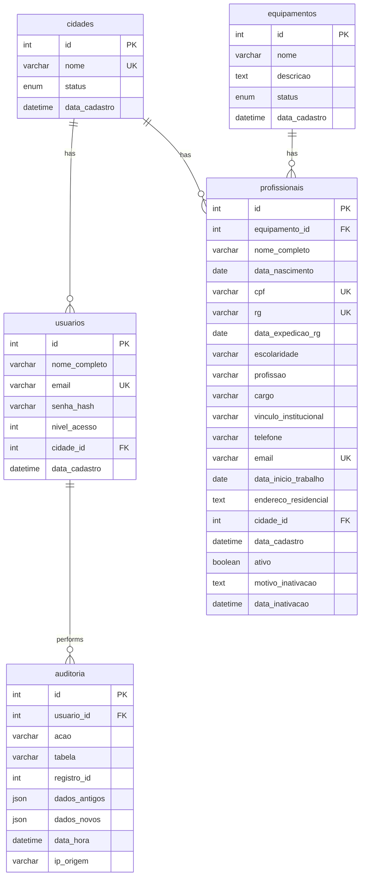

# Modelo de Dados (ERD) para o Sistema de Gerenciamento de Profissionais

Este documento detalha o Modelo de Entidade-Relacionamento (ERD) para o sistema de cadastro e gerenciamento de profissionais, conforme os requisitos fornecidos. O modelo visa garantir a integridade dos dados, a escalabilidade e a flexibilidade necessárias para as funcionalidades propostas.

## Tabelas Principais

A seguir, são descritas as tabelas principais do sistema, seus atributos e os relacionamentos entre elas.

### Tabela: `cidades`

Esta tabela armazena informações sobre as cidades onde os profissionais estão localizados ou atuam. É fundamental para a funcionalidade multi-cidade do sistema.

| Coluna        | Tipo de Dados | Restrições       | Descrição                               |
|---------------|---------------|------------------|-----------------------------------------|
| `id`          | INT           | PK, Auto-incremento | Identificador único da cidade           |
| `nome`        | VARCHAR(255)  | Único, Not Null  | Nome da cidade (padronizado)            |
| `status`      | ENUM          | 'ativo', 'inativo' | Status da cidade no sistema             |
| `data_cadastro` | DATETIME      | Not Null         | Data e hora do cadastro da cidade       |

### Tabela: `equipamentos`

Esta tabela registra os diferentes equipamentos (unidades de serviço) aos quais os profissionais podem estar vinculados, como CRAS, CREAS, CAPS, etc.

| Coluna        | Tipo de Dados | Restrições       | Descrição                               |
|---------------|---------------|------------------|-----------------------------------------|
| `id`          | INT           | PK, Auto-incremento | Identificador único do equipamento      |
| `nome`        | VARCHAR(255)  | Not Null         | Nome do equipamento (ex: CRAS, CREAS)   |
| `descricao`   | TEXT          | Opcional         | Descrição detalhada do equipamento      |
| `status`      | ENUM          | 'ativo', 'inativo' | Status do equipamento no sistema        |
| `data_cadastro` | DATETIME      | Not Null         | Data e hora do cadastro do equipamento  |

### Tabela: `usuarios`

Esta tabela gerencia os usuários do sistema, seus níveis de acesso e o vínculo com cidades específicas para controle de permissões.

| Coluna        | Tipo de Dados | Restrições       | Descrição                               |
|---------------|---------------|------------------|-----------------------------------------|
| `id`          | INT           | PK, Auto-incremento | Identificador único do usuário          |
| `nome_completo` | VARCHAR(255)  | Not Null         | Nome completo do usuário                |
| `email`       | VARCHAR(255)  | Único, Not Null  | Endereço de e-mail do usuário (login)   |
| `senha_hash`  | VARCHAR(255)  | Not Null         | Hash da senha do usuário                |
| `nivel_acesso` | INT           | Not Null         | Nível de acesso (1=Visualização, 2=Editor, 3=Admin Cidade, 4=Admin Global) |
| `cidade_id`   | INT           | FK → cidades.id, Nullable | ID da cidade associada ao usuário (nulo para Admin Global) |
| `data_cadastro` | DATETIME      | Not Null         | Data e hora do cadastro do usuário      |

### Tabela: `profissionais`

Esta é a tabela central do sistema, contendo todas as informações detalhadas sobre cada profissional, incluindo dados pessoais, vínculo institucional e status de atividade.

| Coluna              | Tipo de Dados | Restrições       | Descrição                                         |
|---------------------|---------------|------------------|---------------------------------------------------|
| `id`                | INT           | PK, Auto-incremento | Identificador único do profissional               |
| `equipamento_id`    | INT           | FK → equipamentos.id, Not Null | ID do equipamento ao qual o profissional está vinculado |
| `nome_completo`     | VARCHAR(255)  | Not Null         | Nome completo do profissional                     |
| `data_nascimento`   | DATE          | Not Null         | Data de nascimento do profissional                |
| `cpf`               | VARCHAR(14)   | Único, Not Null  | Cadastro de Pessoa Física (formato XXX.XXX.XXX-XX) |
| `rg`                | VARCHAR(20)   | Único, Not Null  | Registro Geral                                    |
| `data_expedicao_rg` | DATE          | Not Null         | Data de expedição do RG                           |
| `escolaridade`      | VARCHAR(100)  | Not Null         | Nível de escolaridade do profissional             |
| `profissao`         | VARCHAR(100)  | Not Null         | Profissão do profissional                         |
| `cargo`             | VARCHAR(100)  | Not Null         | Cargo ocupado pelo profissional                   |
| `vinculo_institucional` | VARCHAR(255)  | Not Null         | Vínculo institucional do profissional             |
| `telefone`          | VARCHAR(20)   | Not Null         | Telefone de contato                               |
| `email`             | VARCHAR(255)  | Único, Not Null  | Endereço de e-mail do profissional                |
| `data_inicio_trabalho` | DATE          | Not Null         | Data de início do trabalho na instituição         |
| `endereco_residencial` | TEXT          | Not Null         | Endereço residencial completo                     |
| `cidade_id`         | INT           | FK → cidades.id, Not Null | ID da cidade de residência do profissional        |
| `data_cadastro`     | DATETIME      | Not Null         | Data e hora do cadastro do profissional           |
| `ativo`             | BOOLEAN       | Not Null         | Indica se o profissional está ativo (true) ou inativo (false) |
| `motivo_inativacao` | TEXT          | Nullable         | Motivo da inativação (preenchido se `ativo` for false) |
| `data_inativacao`   | DATETIME      | Nullable         | Data e hora da inativação (preenchido se `ativo` for false) |

### Tabela: `auditoria`

Esta tabela registra todas as ações de CRUD (Criação, Leitura, Atualização, Exclusão) realizadas no sistema, garantindo a rastreabilidade e a segurança dos dados.

| Coluna        | Tipo de Dados | Restrições       | Descrição                               |
|---------------|---------------|------------------|-----------------------------------------|
| `id`          | INT           | PK, Auto-incremento | Identificador único do registro de auditoria |
| `usuario_id`  | INT           | FK → usuarios.id, Not Null | ID do usuário que realizou a ação       |
| `acao`        | VARCHAR(255)  | Not Null         | Tipo de ação (ex: 'CREATE', 'UPDATE', 'DELETE') |
| `tabela`      | VARCHAR(255)  | Not Null         | Tabela afetada pela ação                |
| `registro_id` | INT           | Not Null         | ID do registro afetado na tabela        |
| `dados_antigos` | JSON          | Nullable         | Dados do registro antes da alteração (para UPDATE/DELETE) |
| `dados_novos` | JSON          | Nullable         | Dados do registro após a alteração (para CREATE/UPDATE) |
| `data_hora`   | DATETIME      | Not Null         | Data e hora da ação                     |
| `ip_origem`   | VARCHAR(45)   | Nullable         | Endereço IP de onde a ação foi realizada |

## Relacionamentos entre as Tabelas

Os relacionamentos entre as tabelas são cruciais para a integridade referencial e para a correta recuperação dos dados no sistema.

*   **`profissionais`** para **`equipamentos`**: Um profissional pertence a um equipamento (`equipamento_id` FK em `profissionais` referencia `id` PK em `equipamentos`). Relacionamento de N para 1.
*   **`profissionais`** para **`cidades`**: Um profissional reside em uma cidade (`cidade_id` FK em `profissionais` referencia `id` PK em `cidades`). Relacionamento de N para 1.
*   **`usuarios`** para **`cidades`**: Um usuário (Admin Cidade) está associado a uma cidade (`cidade_id` FK em `usuarios` referencia `id` PK em `cidades`). Relacionamento de N para 1 (opcional, pois Admin Global não tem `cidade_id`).
*   **`auditoria`** para **`usuarios`**: Cada registro de auditoria está associado a um usuário que realizou a ação (`usuario_id` FK em `auditoria` referencia `id` PK em `usuarios`). Relacionamento de N para 1.

## Diagrama de Entidade-Relacionamento (ERD)

Para uma representação visual, o seguinte diagrama ilustra as entidades e seus relacionamentos:

Este ERD serve como base para a implementação do banco de dados, garantindo que todas as entidades e seus relacionamentos estejam corretamente definidos para suportar as funcionalidades do sistema.

